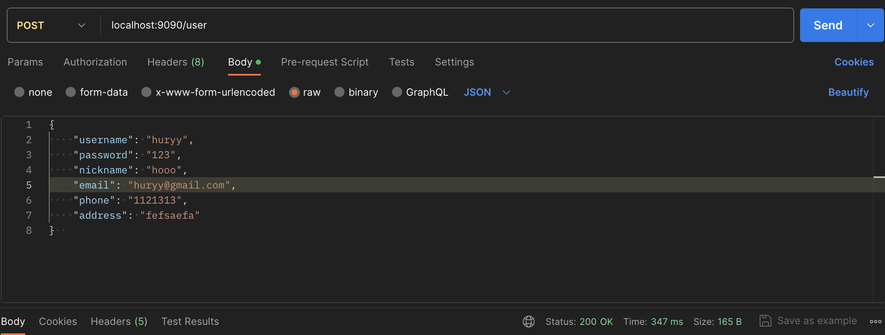
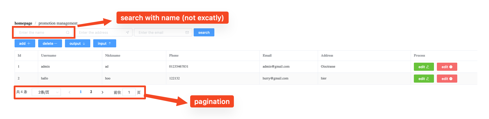
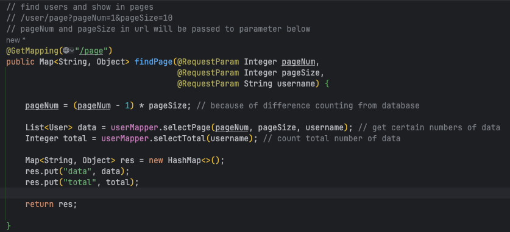
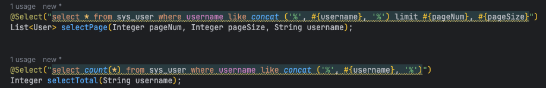

> This is the all and very detailed note during development of this project.
But this is ONLY for personal usage, please don't forward without permission!

# Enviroment set up
- Frontend: `vue create frontend`
  - Element: `npm i element-ui -S`
    - import Element in main.js with the following commands:
      - `import router from './router'`
      - `import ElementUI from 'element-ui';`
      - `Vue.use(ElementUI, "small");`
- Backend: 

- 

# Frontend

## Change Layout

- get code from Element->Layout Container and put that in HomeView.vue 

- App.vue
  ```vue
  <template>
    <div id="app">
      <router-view/>
    </div>
  </template>
  <style>
  #app{
    height: 100%;
  }
  </style>
  ```

- create global.css in ./src/assets
  ```css
  html, body, div {
      margin: 0;
      padding: 0;
  }
  
  html, body {
      height: 100%;
  }
  ```

- import global.css in main.js
  ```js
  import Vue from 'vue'
  import App from './App.vue'
  import router from './router'
  import ElementUI from 'element-ui';  
  import 'element-ui/lib/theme-chalk/index.css';
  import './assets/global.css'
  
  Vue.config.productionTip = false
  Vue.use(ElementUI, "small");
  
  new Vue({
    router,
    render: h => h(App)
  }).$mount('#app')
  
  ```

  

- menu-folder (如何实现侧边栏收缩功能)

# Backend (Springboot)

mytibais

in Postman test the interface(port)



## Package: Entity

### Class: User

User class provide all atributes of user and correspond getter&setter

## Package: controller

### Class: UserController


## Package: Mapper

### Class: UserMapper


## Functions

### Data sending from Frontend to Backend (database)

Interface test: in Postman 

User in JSON write --> send request to port localhost:9090/user --> UserController: @PostMapping (@RequestBody User user): @RequestBody will transfer the instance of JSON to instance of java

Instance of JSON: (you can use Postman for testing)

```json
{
    "username": "huryy",
    "password": "123",
    "nickname": "hooo",
    "email": "huryy@gmail.com",
    "phone": "1121313",
    "address": "fefsaefa"
}  
```

Instance of Java:

```java
public class User {
    private Integer id;
    private String username;
    private String password;
    private String nickname;
    private String email;
    private String phone;
    private String address;
}
```

In UserController: 

```java
@PostMapping
public Integer save(@RequestBody User user) { // what is @RequestBody? instance of json from frontend change to instance of java in backend
		return userMapper.insert(user);
}
```

Now you have instance of User names user and you put it as variable in `save` method, this method will `return userMapper.insert(user);` 

userMapper:

```java
@Insert("INSERT INTO sys_user(username, password, nickname, email, phone, address) VALUES (#{username}, #{password}, #{nickname}, #{email}, #{phone}, #{address})")
int insert(User user);
```

userMapper is a instance of UserMapper, a interface. In UserMapper you define some methods to interact with database, in this project is MySQL. How can we interacte in UserMapper with MySQL? **through mybatis**

`@Insert`: The annotation that specify an SQL for inserting record(s). From package Mybatis.

What is Mybatis?

### User one method to add or update (UserController)

```java
//UserController
@PostMapping
// save: add or update. How can I use one method 'sava' to add user or update user? UserService
public Integer save(@RequestBody User user) {
  	return userMapper.insert(user); // now is only insert
}
```

--> 

```java
//UserController
@PostMapping
public Integer save(@RequestBody User user) {
  	return userService.save(user)); // use userService.save to insert(add) or update user
}
```

```java
public class UserService {
  
  @Autowird
  private UserMapper userMapper;
  
  public int save(User user) {
    
    if(user.getId() == null) {
      return userMapper.insert(user);
    } else {
      return userMapper.update(user);
    }
  }
}
```

### Dynamic SQL (UserMapper, User.xml)

When you update, how to update the certain information not all and not others be replaced by null?

```java
//UserMapper

// if you write like following, then except the updated infor all others will be overwroten by null
@Update("UPDATE sys_user SET username=#{username}, password=#{password}, nickname=#{nickname}, email=#{email}, phone=#{phone}, address=#{address} WHERE id = #{id}")
int update(User user);
```

so what should you do? resources/mapper/User.xml --> Dynamic SQL

```xml
<?xml version="1.0" encoding="UTF-8" ?>
<!DOCTYPE mapper
        PUBLIC "-//mybatis.org//DTD Config 3.0//EN"
        "https://mybatis.org/dtd/mybatis-3-mapper.dtd">
<mapper namespace="com.hurryclear.backend.mapper.UserMapper">
    <update id="update">
        UPDATE sys_user
        <set>
            <if test="username != null">
                username=#{username},
            </if>
<!--            <if test="password != null">-->
<!--                password=#{password}-->
<!--            </if>-->
            <if test="password != null">
                password=#{password},
            </if>
            <if test="nickname != null">
                nickname=#{nickname},
            </if>
            <if test="email != null">
                email=#{email},
            </if>
            <if test="phone != null">
                phone=#{phone},
            </if>
            <if test="address != null">
                address=#{address}
            </if>
        </set>
        <where>
            id = #{id}
        </where>
    </update>
</mapper>
```

AND you have to do a very important step!!!
This file will not be recognized by Spring Boot unless you "tell" Spring Boot. How?

```yml
mybatis:
  mapper-locations: classpath:mapper/*.xml #scan all mybatis xml file
```

### Pagination 



#### In UserController:



#### In UserMapper



#### In HomeView.vue

- In the search box must bind with v-model="username", so you can enter in the certain box, here is "Enter the name"

- When you enter a "username", it need to be passed to load function, so "backend" will know what data you are looking for.. For this reason, you need have @click="load" in the button search

```vue
<!--        search box-->
        <div style="margin: 10px 0">
          <el-input style="width: 200px" placeholder="Enter the name" suffix-icon="el-icon-search" v-model="username"></el-input>
          <el-input style="width: 200px; margin-left: 5px" placeholder="Enter the address" suffix-icon="el-icon-position"></el-input>
          <el-input style="width: 200px; margin-left: 5px" placeholder="Enter the email" suffix-icon="el-icon-message"></el-input>
          <el-button style="margin-left: 5px" type="primary" @click="load">search</el-button>
        </div>
```

- add parameter in data, load in created, fetch in load (not yet really understand, cause have not learned frontend, just "copy")
  - handleSizeChange ?
  - handleCurrentChange ?

```vue
export default {
	data () {

    return {
      tableData: [],
      total: 0,
      pageNum: 1,
      pageSize: 2,
      username: "",
      collapseBtnClass: 'el-icon-s-fold',
      isCollapsed: false,
      sideWidth: 200,
      logoTextShow : true
    }
	},
created() {
    //request page finding
    this.load()
  },
  methods: {
    
    load() {
      fetch("http://localhost:9090/user/page?pageNum=" + this.pageNum + "&pageSize=" + this.pageSize + "&username=" + this.username).then(res => res.json()).then( res=> {
        console.log(res)
        this.tableData = res.data
        this.total = res.total
      })
    },
    handleSizeChange(pageSize) {
      console.log(pageSize)
      this.pageSize = pageSize
      this.load()
    },
    handleCurrentChange(pageNum) {
      console.log(pageNum)
      this.pageNum = pageNum
      this.load()
    }
  }
}
```


### Springboot cross port

add CorsConfig class in config package

```java
package com.hurryclear.backend.config;

import org.springframework.web.filter.CorsFilter;
import org.springframework.context.annotation.Bean;
import org.springframework.context.annotation.Configuration;
import org.springframework.web.cors.CorsConfiguration;
import org.springframework.web.cors.UrlBasedCorsConfigurationSource;

@Configuration
public class CorsConfig {

    private static final long MAC_AGE = 24 * 60 * 60;


    @Bean
    public CorsFilter corsFilter() {
        UrlBasedCorsConfigurationSource source = new UrlBasedCorsConfigurationSource();
        CorsConfiguration corsConfiguration = new CorsConfiguration();
        corsConfiguration.addAllowedOrigin("http://localhost:8080");
        corsConfiguration.addAllowedHeader("*");
        corsConfiguration.addAllowedMethod("*");
        corsConfiguration.setMaxAge(MAC_AGE);
        source.registerCorsConfiguration("/**", corsConfiguration);
        return new CorsFilter(source);
    }
}
```

enable frontend vue visit backend port

# Spring Boot Data JPA

[图灵讲解：底层原理](https://www.bilibili.com/video/BV1NP4y1z7Lo?p=6&spm_id_from=pageDriver&vd_source=5700f6f960dc64a5c17cbedf10fb3a37)

将不同的数据存储统一

ORM(Object, Relation, Mapping): Table --> Class

# Docker

[Explain from Dan Vege: connect and pgAdmin](https://www.youtube.com/watch?v=XDlgWyVfSMA)

connect postgres which in docker`docker exec -it postgres-database psql -U dev -d db_dev`

if you are not sure if there exists "dev" user then list all user`docker exec -it postgres-database psql -U postgres -c "\du"`

if there is no "dev" user then create new `docker exec -it postgres-database psql -U postgres -c "CREATE ROLE dev WITH LOGIN PASSWORD 'dev_pw' CREATEDB;"`

## Postgres

quit `\q`

connect `\c`

